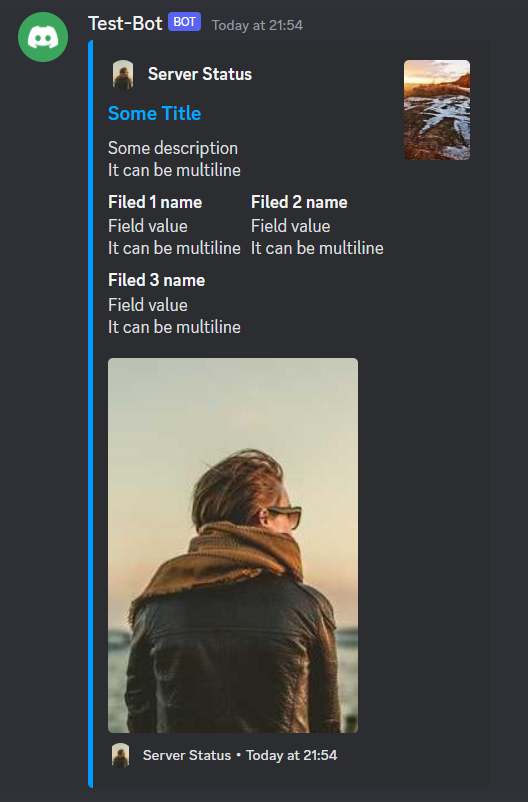

# Embed Discord Bot

This is a simple Discord bot that can embed messages.



## Setup

### Requirements

- [Node.js](https://nodejs.org/en/) (v16.6.0 or higher)

### Creating a bot

- Create application on [Discord Developer Portal](https://discordapp.com/developers/applications/me),
  and create a bot user.
- After that go
  to [OAuth2/URL generator tab](https://discord.com/developers/applications/1080887766851793026/oauth2/url-generator)
  and select `bot` scope.
- Set permissions to `Send Messages`, `Embed Links`, `Read Message History` and `Use slash commands`.
- After that open the generated URL and invite the bot to your server.

### Setup repository

- Clone or download this repository.
- Run `npm install` to install dependencies.
- Create `.env` file in the root of the project and add the following content:

```env
TOKEN=YOUR_BOT_TOKEN # Bot -> Token -> Reset Token -> Copy
CLIENT_ID=YOUR_BOT_CLIENT_ID # General Information -> Application ID -> Copy
GUILD_ID=YOUR_GUILD_ID # RMB on server icon -> Copy ID
```

- Run `npm start` to start the bot.
- Commands should be available in your server.

## Usage

Create xml file with the following format:

```xml
<embed>
    <color>0x0099FF</color>
    <author> <!-- Author in the top left corner -->
        <name>Server Status</name> <!-- Name of the author -->
        <url>https://discord.gg/4Z3Y4Z</url> <!-- Make name clickable -->
        <icon>https://picsum.photos/200/300</icon> <!-- Icon left to the name -->
    </author>
    <title>Some Title</title>
    <url>https://some.url</url> <!-- Make title clickable -->
    <description>
        Some description
        It can be multiline
    </description>
    <thumbnail>https://picsum.photos/200/300</thumbnail> <!-- Thumbnail in the top right corner -->
    <image>https://picsum.photos/200/300</image> <!-- Image in the bottom -->
    <footer>
        <text>Server Status</text>
        <icon>https://picsum.photos/200/300</icon>
    </footer>
    <timestamp>2018-01-01T00:00:00.000Z</timestamp> <!-- Print NOW for current time -->
    <fields>
        <field>
            <name>Filed 1 name</name> <!-- Field name -->
            <value>
                Field value
                It can be multiline
            </value>
            <inline>true</inline> <!-- Display field in the same line as previous field -->
        </field>
        <field>
            <name>Filed 2 name</name>
            <value>
                Field value
                It can be multiline
            </value>
            <inline>true</inline>
        </field>
        <field>
            <name>Filed 3 name</name>
            <value>
                Field value
                It can be multiline
            </value>
            <inline>false</inline>
        </field>
    </fields>
</embed>
```

Then send the file to the bot using `/to-embed` command.
Don't forget to delete `Done` message after you get the embed.

## Commands

### `/to-embed` 
 - attachment: xml file with embed data. See [XML API](#xml-api) for more info. Required.

## XML API

### Embed object
| Property | Type | Description | Required |
| --- | --- | --- | --- |
| color | string | Color of the embed | No |
| author | [Author object](#author-object) | Author in the top left corner | No |
| title | string | Title of the embed | No |
| url | string | Make title clickable | No |
| description | string | Description of the embed | No |
| thumbnail | string | Thumbnail in the top right corner | No |
| image | string | Image in the bottom | No |
| footer | [Footer object](#footer-object) | Footer in the bottom | No |
| timestamp | string | Timestamp in the footer. Print `NOW` for current time | No |
| fields | [Field object](#field-object)[] | Fields in the embed | No |

### Author object
| Property | Type | Description | Required |
| --- | --- | --- | --- |
| name | string | Name of the author | Yes |
| url | string | Make name clickable | No |
| icon | string | Icon left to the name | No |

### Footer object
| Property | Type | Description | Required |
| --- | --- | --- | --- |
| text | string | Text of the footer | Yes |
| icon | string | Icon left to the text | No |

### Field object
| Property | Type | Description | Required |
| --- | --- | --- | --- |
| name | string | Name of the field | Yes |
| value | string | Value of the field | Yes |
| inline | boolean | Display field in the same line as previous field | No |

## License

[MIT](readme/LICENSE)